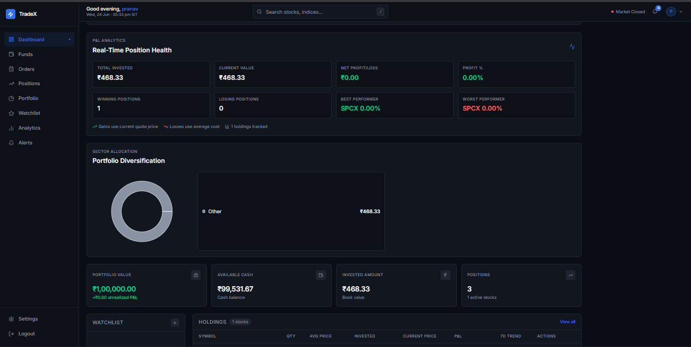
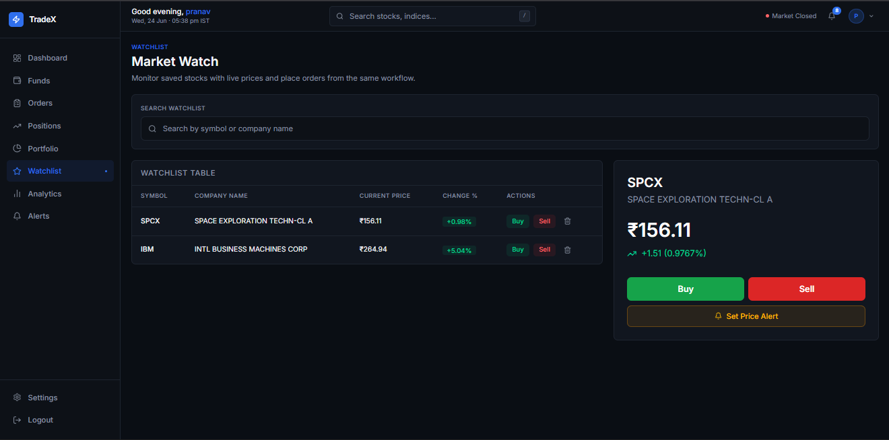
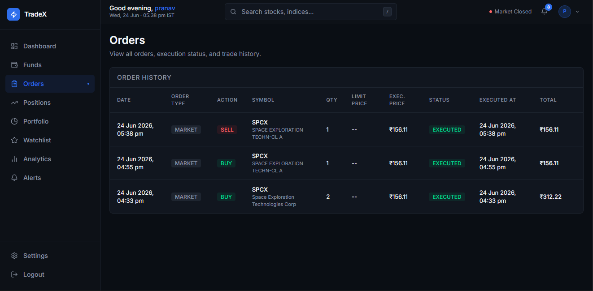
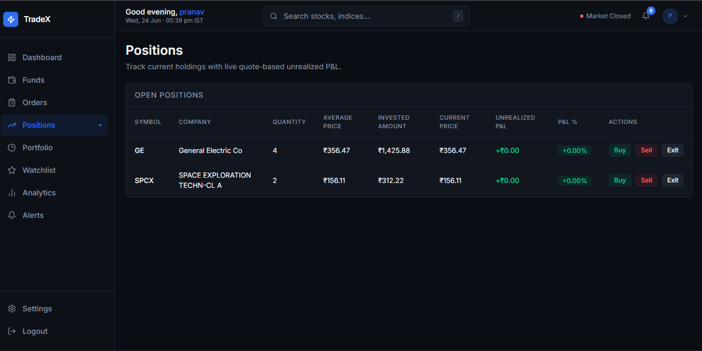
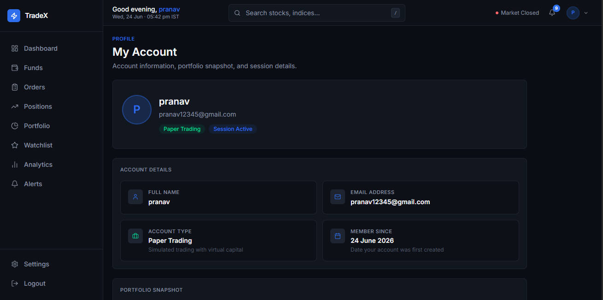
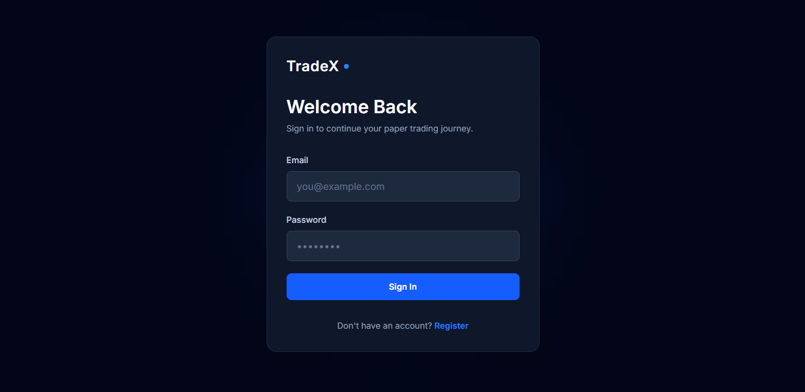

 # 🚀 TradeX

   

TradeX is a full-stack paper trading web application inspired by the design philosophy and trading workflows of **Zerodha Kite**. The platform allows users to practice real-time stock trading using real market data with a virtual cash balance of **₹1,00,000**, offering zero financial risk.

Built with a responsive mobile navigation drawer, real-time quote context subscriptions, price alert triggers, and server-side limit order execution schedules.

### Highlights

- 📈 Real-time stock market data integration
- 💰 ₹1,00,000 virtual trading balance
- 🔔 Price alerts and notifications
- 📊 Portfolio analytics dashboard
- 📱 Fully responsive mobile-first UI

---

## 🔗 Live Demo

🌐 **Live Application:**  
[trade-x-trading-platform-beta.vercel.app](https://trade-x-trading-platform-beta.vercel.app)

---

## 📸 Screenshots

### Dashboard


### Watchlist


### Orders


### Positions


### Profile


### Login


---

## ✨ Features

- **Real-Time Data Engine**: Batch-requests stock quotes via Finnhub API every 20 seconds, deduplicating queries across all active dashboard views.
- **Order Execution Engine**: Processes market buy/sell requests transactionally and runs a backend scheduler every 60 seconds to execute pending limit orders.
- **Price Alerts & Notifications**: Fires toast and persistent notification badges when active quotes cross user-defined price thresholds.
- **Responsive Mobile Navigation**: Adapts sidebar layouts into a collapsible slide-out drawer on mobile devices, optimized for standard smartphone displays.
- **Interactive Portfolio Analytics**: Displays historical portfolio performance and sector diversification metrics using line and donut charts.

---

## 🛠️ Tech Stack

| Component | Technology | Description |
| :--- | :--- | :--- |
| **Frontend** | React (Vite) | Single-page application framework. |
| **Routing** | React Router DOM 7 | Client-side routing. |
| **Charts** | Recharts | Interactive SVG charting library. |
| **Styles** | Tailwind CSS 4 | Utility-first responsive styling. |
| **Backend** | Node.js (Express) | Scalable REST API gateway. |
| **Database** | MongoDB Atlas | Cloud document database with Mongoose. |
| **Security** | JWT, bcrypt, Helmet | Session security and request rate-limiting. |

---

## 📂 Project Structure

```
TradeX/
├── client/
├── server/
├── docs/
│   └── screenshots/
└── README.md
```

---

## ⚡ Installation

### Prerequisites
- Node.js ≥ 18
- MongoDB instance (Atlas or Local)
- Finnhub API Key

### Step-by-Step Setup

1. **Clone the Repository**
   ```bash
   git clone https://github.com/pranav2004-ops/TradeX-Trading-Platform.git
   cd TradeX-Trading-Platform
   ```

2. **Install Dependencies**
   ```bash
   # Install client packages
   cd client && npm install
   # Install server packages
   cd ../server && npm install
   ```

3. **Configure Environment Variables**
   Create a `.env` file in the `server` directory (see configuration parameters below).

4. **Start Development Servers**
   ```bash
   # Terminal 1: Backend Server (Port 8000)
   cd server && npm run dev

   # Terminal 2: Frontend Client (Port 5173)
   cd client && npm run dev
   ```

---

## 🔑 Environment Variables

Create a `server/.env` file with the following variables:

```env
PORT=8000
MONGO_URI=your_mongodb_connection_uri
JWT_SECRET=your_jwt_signing_secret
FINNHUB_API_KEY=your_finnhub_api_token
```

---

## 🔮 Future Improvements

- **Profile Editing & Avatars**: Allow users to update their profiles and upload profile avatars.
- **WebSocket Live Market Updates**: Transition from REST polling to a streaming connection for instant quote feeds.
- **Advanced Charting**: Implement intraday interactive candlestick charting libraries.
- **Password Reset Flow**: Implement automated password recovery workflows.

---

 ## 👨‍💻 Author

**Pranav Prasoon**

- GitHub: [pranav2004-ops](https://github.com/pranav2004-ops)
- LinkedIn: [Pranav Prasoon](https://www.linkedin.com/in/pranavprasoon18/)

---

## 📄 License

This project is licensed under the **MIT License**. Refer to the [LICENSE](LICENSE) file for details.
